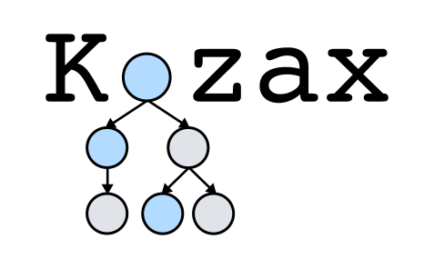

<div align="center">
  
</div>

# Kozax: Flexible and Scalable Genetic Programming in JAX
Kozax introduces a general framework for evolving computer programs with genetic programming in JAX. With JAX, the computer programs can be vectorized and evaluated on parallel on CPU and GPU. Furthermore, just-in-time compilation provides massive speedups for evolving offspring. Check out the [paper](https://arxiv.org/abs/2502.03047) introducing Kozax.

# Features
Kozax allows the user to:
- define custom operators
- define custom fitness functions
- use trees flexibly, ranging from symbolic regression to reinforcement learning
- evolve multiple trees simultaneously, even with different inputs
- numerically optimise constants in the computer programs

# How to use
You can install Kozax via pip with
```
pip install kozax
```

Below is a short demo showing how you can use kozax. First we generate data:
```python
import jax
import jax.numpy as jnp
import jax.random as jr

key = jr.PRNGKey(0) #Initialize key
data_key, gp_key = jr.split(key) #Split key for data and genetic programming
x = jr.uniform(data_key, shape=(30,), minval=-5, maxval = 5) #Inputs
y = -0.1*x**3 + 0.3*x**2 + 1.5*x #Targets
```

Now we have to define a fitness function. This allows for much freedom, because you can use the computer program anyway you want to during evaluation. 
```python
from kozax.fitness_functions.base_fitness_function import BaseFitnessFunction

class FitnessFunction(BaseFitnessFunction):
  """
    The fitness function inherits the class BaseFitnessFunction and should implement the __call__ function, with the candidate, data and tree_evaluator as inputs. The tree_evaluator is used to compute the value of the candidate for each input. jax.vmap is used to vectorize the evaluation of the candidate over the inputs. The candidate's predictions are used to compute the fitness value with the mean squared error.
  """
  def __call__(self, candidate, data, tree_evaluator):
    X, Y = data
    predictions = jax.vmap(tree_evaluator, in_axes=[None, 0])(candidate, X)
    return jnp.mean(jnp.square(predictions-Y))

fitness_function = FitnessFunction()
```

Now we will use genetic programming to recover the equation from the data. This requires defining the hyperparameters, initializing the population and the general loop of evaluating and evolving the population.
```python
from kozax.genetic_programming import GeneticProgramming

#Define hyperparameters
population_size = 500
num_generations = 100

#Initialize genetic programming strategy
strategy = GeneticProgramming(num_generations, population_size, fitness_function)

#Fit the strategy on the data. With verbose, we can print the intermediate solutions.
strategy.fit(gp_key, (x, y), verbose = True)
```

There are additional [examples](https://github.com/sdevries0/kozax/tree/main/examples) on how to use kozax on more complex problems.

|Example|Notebook|Script|
|---|---|---|
|Symbolic regression of a dynamical system|[Notebook](examples/example_notebooks/symbolic_regression_dynamical_system.ipynb)|[Script](examples/example_scripts/symbolic_regression_dynamical_system.py)|
|Control policy optimization in Gymnax environment|[Notebook](examples/example_notebooks/control_policy_optimization.ipynb)|[Script](examples/example_scripts/control_policy_optimization.py)|
|Control policy optimization with dynamic memory|[Notebook](examples/example_notebooks/control_policy_optimization_with_memory.ipynb)|[Script](examples/example_scripts/control_policy_optimization_with_memory.py)|
|Optimization of a loss function to train a neural network|[Notebook](examples/example_notebooks/objective_function_optimization.ipynb)|[Script](examples/example_scripts/objective_function_optimization.py)|


# Citation
If you make use of this code in your research paper, please cite:
```
@article{de2025kozax,
  title={Kozax: Flexible and Scalable Genetic Programming in JAX},
  author={de Vries, Sigur and Keemink, Sander W and van Gerven, Marcel AJ},
  journal={arXiv preprint arXiv:2502.03047},
  year={2025}
}
```
